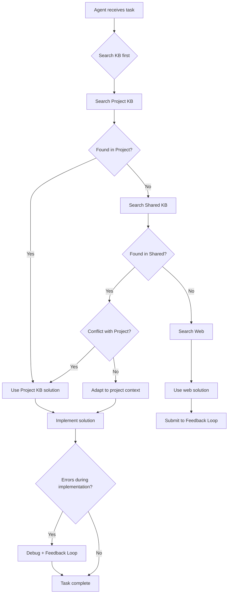

# Information Retrieval - Cascading Search Protocol

**Version:** 5.1.0
**Last Updated:** 2026-01-08

---

## Overview

**Information Retrieval** is a fundamental part of agent work. In v5.1 architecture, it's implemented as **"Cascading Search"** - a strict priority protocol: **Project → Shared → Web**.

This ensures agents follow project standards, avoid reinventing the wheel, and maintain architectural consistency.

---

## Philosophy: "Search First"

**Golden Rule in Agent Instructions:**

> *"Don't reinvent the wheel before checking the garage."*

Before generating code or searching Google, agents **MUST** search local knowledge bases first.

**Benefits:**
- 💰 **Token savings:** No need to regenerate known solutions
- 🏗️ **Architectural consistency:** Follows project patterns
- ⚡ **Speed:** Milliseconds vs seconds for web search
- 🔒 **Privacy:** Queries stay on local machine
- ✅ **Quality:** Uses vetted, curated solutions

---

## Cascading Search Algorithm

Agents search sequentially, descending abstraction levels.

```
┌─────────────────────────────────────────────────────────────┐
│  Level 1: Project KB (Highest Priority)                    │
│  ↓                                                        │
│  Level 2: Shared KB (Medium Priority)                      │
│  ↓                                                        │
│  Level 3: Web Search (Lowest Priority)                      │
└─────────────────────────────────────────────────────────────┘
```

### Level 1: Project KB (Highest Priority)

**Purpose:** Find project-specific knowledge

**What to search:**
- "How do we configure DB here?"
- "Where are the secrets stored?"
- "Why is this test failing?"
- "What's our API authentication pattern?"

**Logic:** Project KB can **override** Shared KB standards

**Example:**
```
Shared KB says: "Use PostgreSQL 16"
Project KB says: "This legacy project uses PostgreSQL 12"
Agent decision: Use PostgreSQL 12 (Project KB wins)
```

### Level 2: Shared KB (Medium Priority)

**Purpose:** Find organizational standards

**What to search:**
- "How to properly implement Retry in Python?"
- "Dockerfile template for Node.js"
- "FastAPI CORS middleware pattern"
- "pytest configuration best practices"

**Logic:** If no project-specific guidance, use org's "gold standard"

### Level 3: Web Search (Lowest Priority)

**Purpose:** Find novelty and recent changes

**What to search:**
- New library version errors
- Recent API changes
- Undocumented edge cases
- Community discussions

**Logic:** Only used when internal KBs are silent

**Important:** Solutions found here are candidates for Feedback Loop submission!

---

## Technical Implementation

### Tool: kb_search.py

Located at `.kb/shared/tools/kb_search.py`

#### Step A: Query Formulation

Agent analyzes task and creates search query.

**Bad queries:**
- ❌ "error"
- ❌ "problem"
- ❌ "help"

**Good queries:**
- ✅ "FastAPI CORS middleware configuration"
- ✅ "Docker compose healthcheck timeout"
- ✅ "SQLAlchemy connection pool exhaustion"

**Tips:**
- Use framework names (FastAPI, Django, React)
- Include error type (CORS, timeout, pool)
- Add context (configuration, setup, deployment)

#### Step B: Execution

Agent runs search tool:

```bash
# Search everywhere (recommended)
python .kb/shared/tools/kb_search.py --scope all "fastapi cors"

# Search only Project KB
python .kb/shared/tools/kb_search.py --scope project "redis"

# Search only Shared KB
python .kb/shared/tools/kb_search.py --scope shared "pytest"

# Search with preview
python .kb/shared/tools/kb_search.py "docker" --preview
```

**What happens:**

1. Scans `.kb/project/**/*.yaml` (all subdirectories)
2. Scans `.kb/shared/domains/**/*.yaml`
3. Parses YAML, searches in fields:
   - `title`
   - `problem`
   - `solution.code`
   - `solution.explanation`
   - `tags`

#### Step C: Result Display

Script returns structured response:

```text
🔍 Search: 'fastapi cors' | Found: 2

--- PROJECT KB (1 entries) ---

📄 .kb/project/knowledge/decisions/cors-policy.yaml

Title: Strict CORS for Production
Severity: high
Category: configuration

Summary:
Allow only specific origins from ENV.
Do not use wildcard ["*"] in production.

--- SHARED KB (1 entries) ---

📄 .kb/shared/domains/python/fastapi-cors-pattern.yaml

Title: FastAPI CORS Middleware Setup
Severity: medium
Category: web-framework

Summary:
How to properly configure CORSMiddleware in FastAPI.
Order matters: register middleware BEFORE routes.
```

---

## Agent's Cognitive Process

### 1. Relevance Assessment

Agent reads found files and filters:

```
"Found Flask CORS setup, but I need FastAPI"
→ Ignore

"Found generic CORS advice, need Pydantic v2 specific"
→ Ignore

"Found FastAPI >= 0.95 CORS pattern"
→ Use this one
```

### 2. Conflict Resolution

**Rule:** Project KB ALWAYS wins over Shared KB

**Example scenario:**

```
Shared KB: "Allow all origins with ['*']"
Project KB: "Strict CORS: only specific domains from ENV"

Agent's thought process:
"Shared KB suggests wildcard, but project explicitly
forbids it and requires domain whitelist. I will follow
project instruction."
```

**Decision matrix:**

| Conflict | Resolution |
|----------|------------|
| Project KB vs Shared KB | **Project KB wins** |
| Project KB vs Web | **Project KB wins** |
| Shared KB vs Web | **Shared KB wins** (unless outdated) |
| Multiple Project KB entries | **Most specific wins** |

### 3. Context Injection

Agent adapts found solution to current task:

```
Found solution (generic):
  host = "localhost"
  port = 6379

Agent adapts using Project KB:
  host = project_kb["redis_host"]  # From Project KB
  port = project_kb["redis_port"]
  mode = project_kb["redis_mode"]   # "sentinel" (not direct)
```

---

## Complete Example: Redis Setup

### Scenario

Agent needs to configure Redis connection for a FastAPI application.

### Step 1: Search

```bash
python .kb/shared/tools/kb_search.py "redis connection pool"
```

### Step 2: Results

```text
🔍 Search: 'redis connection pool' | Found: 2

--- PROJECT KB (1 entries) ---

📄 .kb/project/integrations/redis-config.yaml
Title: Production Redis Configuration
Summary:
We use Redis Sentinel for high availability.
Hosts: redis-sentinel-1, redis-sentinel-2, redis-sentinel-3
Port: 26379
Master name: myapp-master

--- SHARED KB (1 entries) ---

📄 .kb/shared/domains/python/redis-pool.yaml
Title: Redis Connection Pool Best Practices
Summary:
How to properly create connection pool in Python.
Use redis.ConnectionPool with max_connections=50.
```

### Step 3: Agent Synthesis

```python
# Agent combines both sources:

from redis import Redis, Sentine
l
import os

# From Shared KB: Proper pooling pattern
pool = redis.ConnectionPool(
    max_connections=50,
    socket_timeout=5,
    socket_connect_timeout=5,
)

# From Project KB: Sentinel configuration
sentinel = redis.Sentinel(
    [
        ('redis-sentinel-1', 26379),
        ('redis-sentinel-2', 26379),
        ('redis-sentinel-3', 26379),
    ],
    socket_timeout=5,
    socket_connect_timeout=5,
    master_name='myapp-master',
    connection_pool=pool,  # Combining Shared KB pattern
)

# Get master
master = sentinel.master_for('myapp-master')
```

**Result:**
- ✅ Proper pooling pattern (from Shared KB)
- ✅ Correct configuration for environment (from Project KB)
- ✅ Follows organizational standards
- ✅ Matches project infrastructure

---

## Search Strategy Guide

### When to Search Each Level

**Search Project KB when:**
- Looking for project-specific configuration
- Need internal service URLs/names
- Checking business rules
- Finding project-specific workarounds

**Search Shared KB when:**
- Implementing standard features
- Setting up common integrations
- Following framework best practices
- Solving common errors

**Search Web when:**
- Dealing with very new library versions
- Encountering undocumented errors
- Need community discussions
- Checking latest documentation

### Query Optimization Tips

**1. Start Specific, Then Broad:**

```bash
# Too specific (might miss)
python kb_search.py "FastAPI 0.104.2 CORS exact error"

# Better
python kb_search.py "fastapi cors error"

# If no results, broaden
python kb_search.py "cors middleware"
```

**2. Use Framework Names:**

```bash
# Good
python kb_search.py "django user model"

# Better (version-specific)
python kb_search.py "django 5.0 user model"
```

**3. Include Error Types:**

```bash
# Good
python kb_search.py "docker"

# Better (specific problem)
python kb_search.py "docker compose healthcheck timeout"
```

### Search Frequency Protocol

**MANDATORY searches:**
- Before implementing any feature
- When encountering any error
- Before choosing libraries/technologies
- When configuring infrastructure

**OPTIONAL searches:**
- During exploratory coding
- When researching alternatives
- For learning (not implementing)

---

## Performance Characteristics

### Speed Comparison

| Search Type | Latency | Network |
|-------------|---------|---------|
| Project KB | ~10ms | None (local disk) |
| Shared KB | ~50ms | None (local disk) |
| Web Search | ~2-5s | Internet required |

### Why Cascading Search is Efficient

**1. Speed:**
- Text search on local files: milliseconds
- No network latency
- No API rate limits

**2. Privacy:**
- Queries stay on developer's machine
- No data sent to external services
- CI/CD friendly

**3. Consistency:**
- Searches pinned version of Shared KB (git submodule)
- Stable results across environments
- Predictable behavior

**4. Freshness:**
- Update Shared KB: `git submodule update --remote`
- Instant access to new knowledge
- No cache invalidation issues

---

## Integration with Agent Workflow

### Typical Agent Session Flow



### Agent Instructions (Recommended)

Add to `.claude/agents/<agent-name>.md` or `CLAUDE.md`:

```markdown
## Information Retrieval Protocol

**MANDATORY:** Before solving any problem:

1. **Search Local Knowledge Bases:**
   ```bash
   python .kb/shared/tools/kb_search.py --scope all "<query>"
   ```

2. **Prioritize Results:**
   - Project KB > Shared KB > Web
   - Most specific > Most general
   - Recent > Old (check dates)

3. **Resolve Conflicts:**
   - Project KB ALWAYS overrides Shared KB
   - When in doubt, ask for clarification

4. **If No Results:**
   - Try broader search terms
   - Search Web (document source)
   - Consider Feedback Loop submission

**NEVER skip search.** Every minute spent searching saves 10 minutes reinventing.
```

---

## Troubleshooting

### Issue: Too Many Results

**Problem:** Search returns 50+ entries, hard to find relevant ones

**Solutions:**
1. Use more specific query
2. Add framework version
3. Include error type
4. Use `--preview` to see content

```bash
# Too broad
python kb_search.py "error"

# Better
python kb_search.py "fastapi websocket connection error"
```

### Issue: No Results Found

**Problem:** Search returns 0 matches

**Solutions:**
1. Try broader query
2. Check if KB is initialized
3. Verify YAML files exist
4. Fall back to Web search

```bash
# Step 1: Broader query
python kb_search.py "websocket"

# Step 2: Check KB stats
python kb_search.py --stats

# Step 3: If still nothing, search Web
# (Remember to submit solution to Feedback Loop!)
```

### Issue: Outdated Information

**Problem:** Found solution is for old library version

**Solutions:**
1. Check `last_updated` field in YAML
2. Update Shared KB: `git submodule update --remote`
3. Search Web for recent changes
4. Submit updated solution via Feedback Loop

---

## Best Practices

### For Agents

**DO:**
- ✅ Always search before implementing
- ✅ Use specific, well-formed queries
- ✅ Prioritize Project KB over Shared KB
- ✅ Adapt solutions to current context
- ✅ Document conflicts and resolutions

**DON'T:**
- ❌ Skip search to "save time"
- ❌ Use vague queries
- ❌ Ignore Project KB overrides
- ❌ Copy-paste without adaptation
- ❌ Assume web search is better

### For Knowledge Curators

**DO:**
- ✅ Keep entries updated (change `last_updated`)
- ✅ Use clear, searchable titles
- ✅ Add relevant tags
- ✅ Include version information
- ✅ Link related entries

**DON'T:**
- ❌ Use generic titles ("Error fix")
- ❌ Forget to update dates
- ❌ Omit framework versions
- ❌ Create duplicate entries
- ❌ Leave out explanations

---

## Summary

**Cascading Search** ensures agents:

1. ✅ **Check Project KB first** - Follow project-specific patterns
2. ✅ **Then Shared KB** - Use organizational standards
3. ✅ **Finally Web** - Find novelty when needed
4. ✅ **Prioritize correctly** - Project overrides Shared overrides Web
5. ✅ **Synthesize solutions** - Combine best from multiple sources
6. ✅ **Feed back** - Submit new learnings via Feedback Loop

**Key Benefits:**
- ⚡ **Fast:** Milliseconds, not seconds
- 🔒 **Private:** No external queries
- 🎯 **Consistent:** Follows patterns
- 📈 **Improving:** Learns over time

**Result:** Agents that stand on the shoulders of giants, not reinvent the wheel.

---

**Related Documentation:**
- [FEEDBACK-LOOP.md](FEEDBACK-LOOP.md) - Learning from search results
- [WORKFLOWS.md](WORKFLOWS.md) - Agent workflows
- [kb_search.py source](../../tools/kb_search.py) - Search tool
